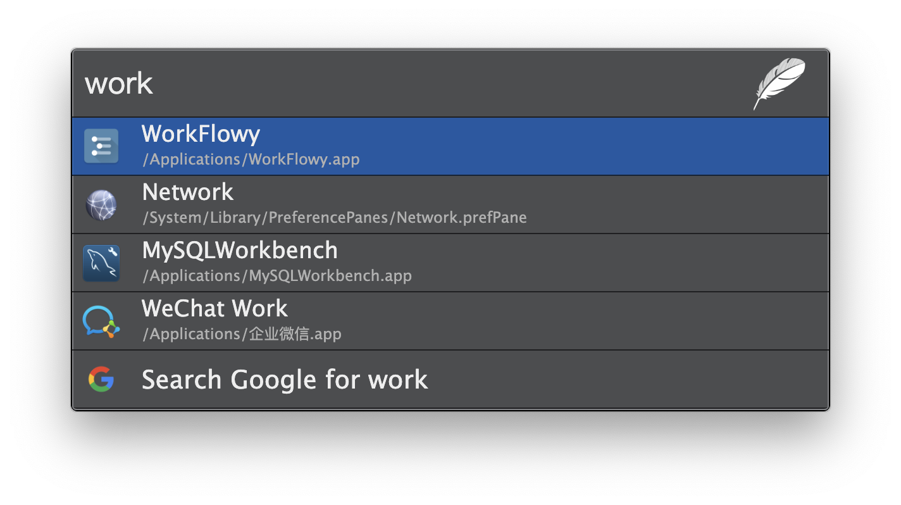

## Spotlight dark Theme

A spotlight dark theme written in SASS with node/gulp.

[View a demo](https://tinytacoteam.github.io/zazu-theme-playbook/#pysnow530/zazu-spotlight-dark-theme)

## Installing

Mark `pysnow530/zazu-spotlight-dark-theme` inside of your `~/.zazurc.json` file.

~~~ json
{
  "theme": "pysnow530/zazu-spotlight-dark-theme"
}
~~~

## Building

~~~
npm install
npm run build
~~~
